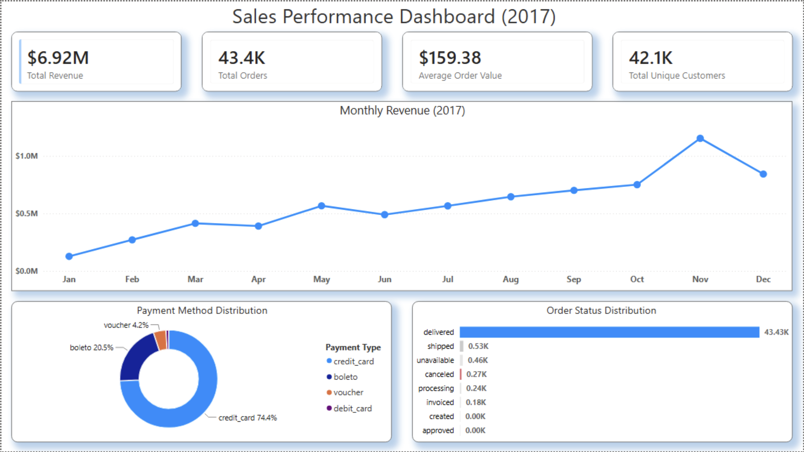
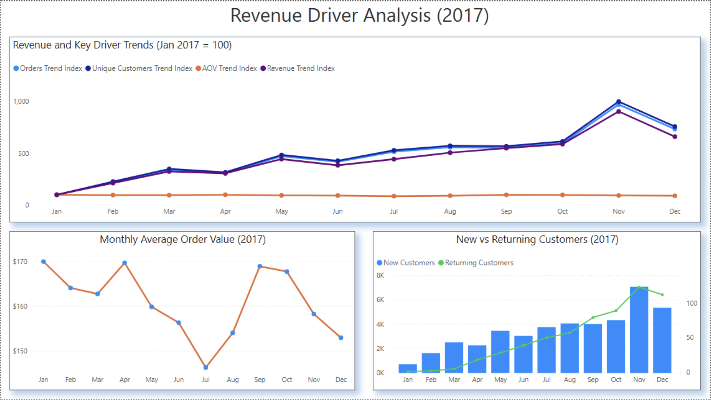
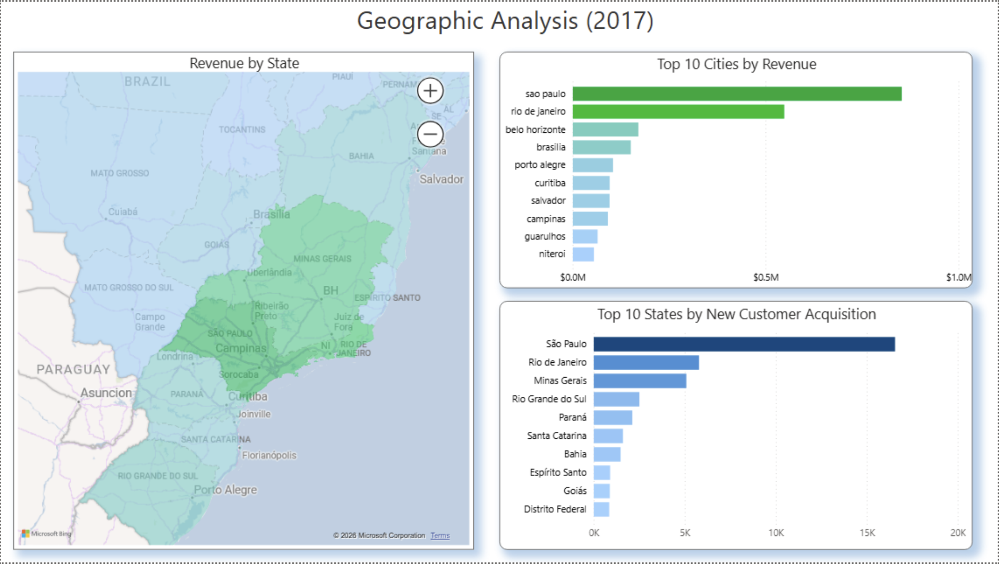
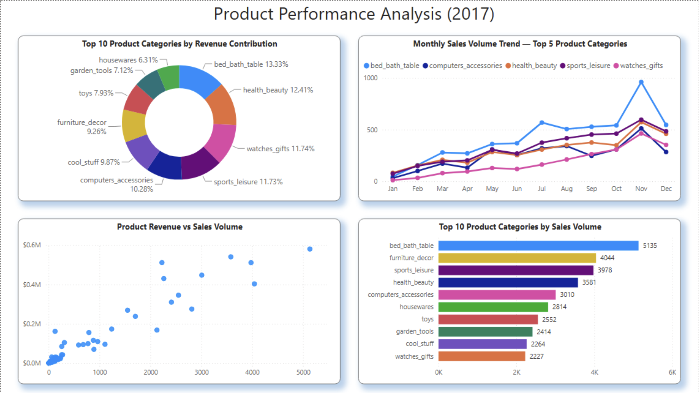
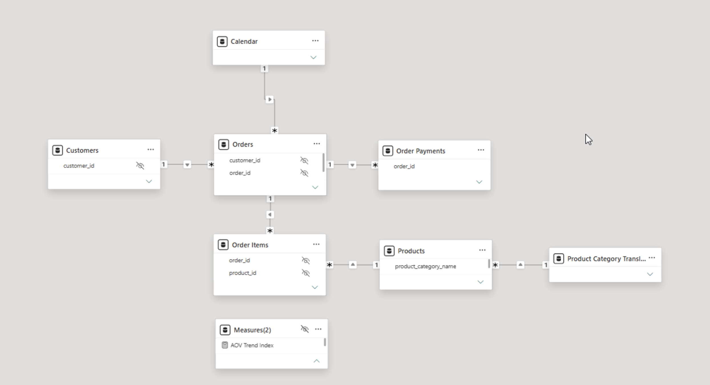

# Olist 2017 Sales Performance Analysis

## 📌 Business Problem

Olist's executive team needs a comprehensive understanding of its sales performance in 2017. While overall revenue provides a high-level view of business performance, the company needs to understand the key factors driving revenue growth, how customer acquisition and order behavior contribute to performance, where sales and customers are geographically concentrated, and which product categories generate the most value and sales volume.

This analysis evaluates Olist's 2017 sales performance and moves beyond simply measuring revenue to identify the underlying drivers of growth.

## 🎯 Objective

- Evaluate overall sales performance in 2017.
- Analyze monthly revenue trends and changes.
- Identify the primary drivers of revenue growth through driver analysis.
- Examine changes in order volume, Average Order Value (AOV), and customer growth.
- Analyze whether growth was primarily driven by new or repeat customers.
- Identify geographic concentration in customers and revenue.
- Evaluate product category performance by revenue and sales volume.

---

# 📊 Dashboard

## Sales Performance Overview

## Revenue Driver Analysis

## Geographic Analysis

## Product Performance Analysis

---

# 🗂 Dataset and Preparation

The analysis uses the **Olist Brazilian E-Commerce dataset**, which contains information on customers, orders, order items, payments, products, sellers, reviews, and geographic data.

The dataset contains:

| Table | Records |
|---|---:|
| Customers | 99,441 |
| Orders | 99,441 |
| Order Items | 112,650 |
| Order Payments | 103,886 |
| Order Reviews | 99,224 |
| Products | 32,951 |
| Sellers | 3,095 |
| Geolocation | 1,000,163 |

The dataset covers transactions from **September 2016 to October 2018**, with this analysis focused specifically on **delivered orders placed during 2017**. :contentReference[oaicite:1]{index=1}

### Data Preparation

Before conducting the analysis, the dataset was explored and assessed for data quality.

The preparation process included:

- Understanding table structure and record volumes.
- Identifying the dataset time range.
- Reviewing relationships between customers, orders, products, sellers, and transactions.
- Checking critical columns for missing values.
- Checking primary keys for duplicate records.
- Checking product prices and freight values for invalid negative values.
- Handling missing product category names during analysis using `COALESCE()` without modifying the raw dataset.

The assessment found no duplicate primary keys or negative price/freight values. The main data quality issue identified was **610 missing product category names**, which were handled as `Unknown` during analysis.

### Data Model

---

# 🛠 Concepts and Tools Used

## SQL

The analysis was performed using **Google BigQuery SQL**.

Key concepts included:

- **Data Exploration**
  - Record counts
  - Time range analysis
  - Unique entity analysis

- **Data Quality Assessment**
  - Missing value checks
  - Duplicate primary key checks
  - Invalid value checks

- **Driver Analysis**
  - Revenue trends
  - Month-over-month revenue change
  - Order volume analysis
  - Average Order Value (AOV)
  - Customer growth
  - New vs repeat customer analysis
  - Geographic contribution analysis
  - Product category performance
  - Revenue vs sales volume comparison

- **SQL Techniques**
  - `JOIN`
  - `GROUP BY`
  - `CASE WHEN`
  - `COALESCE`
  - Common Table Expressions (CTEs)
  - Window functions
  - `LAG()`
  - Date functions
  - Aggregations
  - Percentage calculations

## Power BI

The SQL analysis was visualized through an interactive Power BI dashboard.

Key Power BI concepts used:

- Data modeling and table relationships
- DAX measures
- Power Query
- Calculated metrics
- KPI cards
- Time-series analysis
- Interactive filtering
- Geographic visualizations
- Product performance analysis
- Business-focused dashboard design

## 📐 Key Metrics

The analysis focused on the following key business metrics:

- **Total Revenue** — Total revenue generated from delivered orders, including product price and freight value.
- **Monthly Revenue** — Revenue performance tracked across each month of 2017.
- **Revenue Change & Growth** — Month-over-month change in revenue used to identify periods of growth and decline.
- **Total Orders** — Number of delivered orders placed during the analysis period.
- **Order Growth** — Monthly change in order volume to evaluate its relationship with revenue growth.
- **Average Order Value (AOV)** — Average revenue generated per order.
- **Total Unique Customers** — Number of distinct customers placing delivered orders.
- **New vs Returning Customers** — Customer classification based on whether an order represented their first purchase or a repeat purchase.
- **Customer Contribution %** — Percentage contribution of each state to Olist's unique customer base.
- **Revenue Contribution %** — Percentage contribution of states and product categories to total revenue.
- **Total Items Sold** — Number of products sold, used to compare sales volume with revenue performance.

## 🧰 Tools

* Google BigQuery
* SQL
* Power BI
* DAX
* Power Query
* Git & GitHub

# 📈 Key Insights

### 1. Revenue grew significantly throughout 2017

Olist generated approximately **R$6.92 million in revenue** from delivered orders placed during 2017.

Revenue increased from approximately **R$127.5K in January** to a peak of approximately **R$1.15M in November**.

---

### 2. Order volume was the primary driver of revenue growth

Monthly order volume increased substantially during the year, from approximately **750 orders in January** to **7,289 orders in November**.

The strongest increase in revenue occurred alongside a major increase in order volume, indicating that transaction growth was a key driver of overall revenue performance.

---

### 3. AOV was not the primary driver of growth

Average Order Value fluctuated throughout the year and generally declined from approximately **R$169.98 in January** to **R$152.93 in December**.

Despite this decline, revenue continued to grow, suggesting that Olist's growth was driven primarily by **more orders rather than higher spending per order**.

---

### 4. New customer acquisition drove customer growth

The number of unique customers placing orders increased significantly throughout 2017.

Customers placing orders were primarily **new customers**, while repeat customers represented a relatively small share of the active customer base.

This indicates the following driver relationship:

**Revenue Growth → More Orders → More Customers → Primarily New Customers**

---

### 5. Sales and customers were geographically concentrated

São Paulo was Olist's largest market, contributing approximately:

- **39.28% of unique customers**
- **35.08% of total revenue**

Together, São Paulo, Rio de Janeiro, and Minas Gerais accounted for approximately:

- **65.09% of unique customers**
- **61.63% of revenue**

This demonstrates a significant concentration of business activity in a small number of key markets.

---

### 6. Product revenue was diversified

The top-performing product categories included:

- `bed_bath_table`
- `health_beauty`
- `watches_gifts`
- `sports_leisure`
- `computers_accessories`

The top five categories contributed approximately **38.10% of total revenue**, indicating that Olist's revenue was distributed across multiple product categories rather than relying heavily on a single category.

---

### 7. Revenue and sales volume did not always follow the same pattern

Some categories generated high revenue through large sales volume, while others generated strong revenue despite relatively low sales volume.

For example:

- `bed_bath_table` generated both high sales volume and high revenue.
- `watches_gifts` generated a relatively strong share of revenue compared with its sales volume.
- `computers` generated a disproportionately high share of revenue relative to the number of items sold.

This demonstrates that **sales volume alone is not sufficient to evaluate product performance**.

---

# 💼 Business Recommendations

### 1. Strengthen customer retention

Since 2017 growth was driven primarily by new customer acquisition, Olist should focus on converting first-time customers into repeat buyers through:

- Personalized recommendations
- Loyalty initiatives
- Post-purchase engagement
- Targeted reactivation campaigns

Improving retention could reduce dependence on continuously acquiring new customers.

### 2. Prioritize high-performing geographic markets

São Paulo, Rio de Janeiro, and Minas Gerais represent a significant share of both customers and revenue.

Olist should continue strengthening its presence in these key markets while identifying opportunities to expand customer acquisition in underpenetrated states.

### 3. Analyze high-value product categories separately from high-volume categories

Product categories should not be evaluated using sales volume alone.

Olist should distinguish between:

- **High-volume categories** that drive transaction growth.
- **High-value categories** that generate more revenue per item.

This can support better decisions around seller acquisition, product assortment, and category growth strategies.

### 4. Improve Average Order Value

Since revenue growth was primarily volume-driven, increasing AOV represents an additional opportunity for growth.

Potential strategies include:

- Product bundles
- Cross-selling
- Upselling
- Personalized product recommendations
